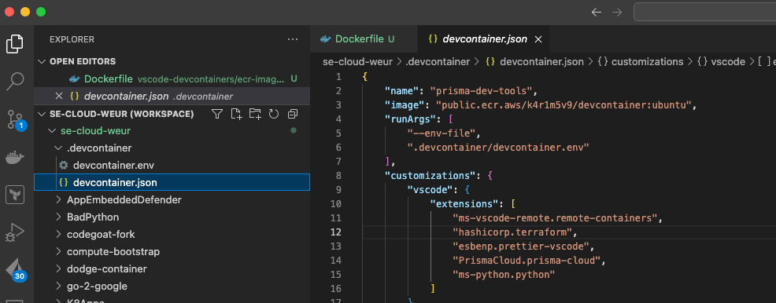
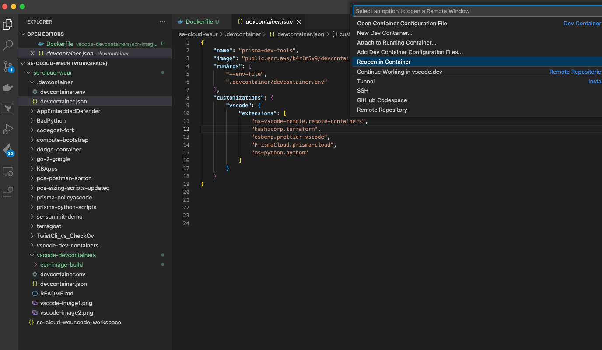

## vscode-dev-containers

This folder containers a devcontainer.json and devcontainer.env file that can be used for vs-code and development. The images is stored in AWS ECR and can be updated with additional components if needed, at present it has the following:

- gcp-tools
- terraform
- python and libraries - requests, pandas, dotenv

Copy devcontainer.json(vs-code config) and devcontain.env(environment variables for prisma) into a folder you want to work with on vscode, then you can re-open that folder in a container. For Example:

Local folder with all my git repos that are cloned that has a .devcontainer:

Once the dev container exists you can click in the bottom lift and select launch as container, this will install all the required tools in a container and enable working without installing software on your machine:

